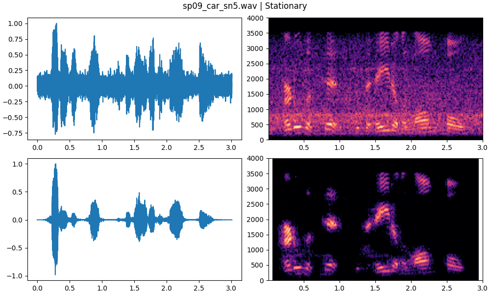
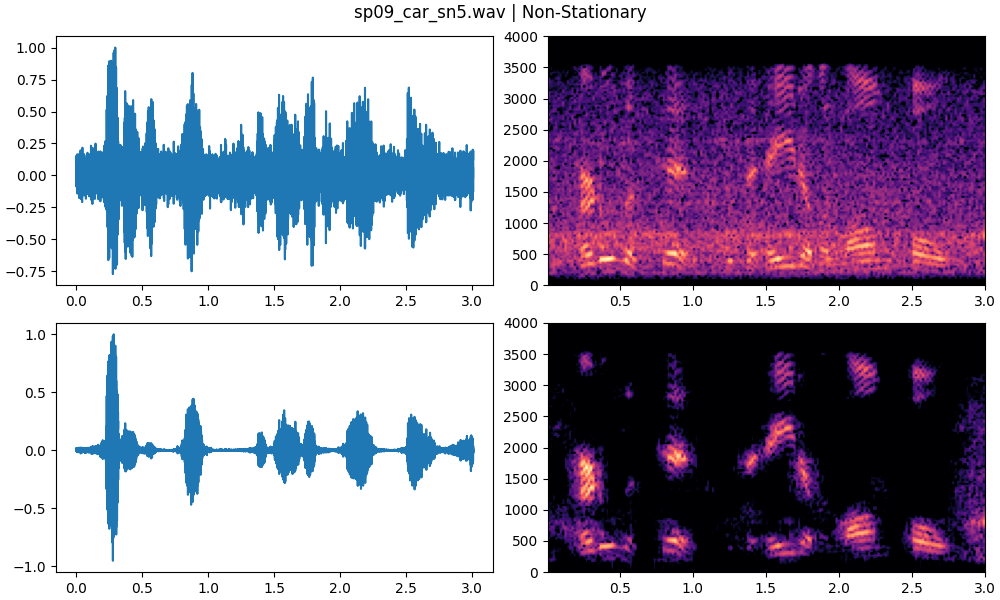

# TorchSpectralGating

TorchSpectralGate is a PyTorch-based implementation of Spectral Gating, an algorithm for denoising audio signals.

The algorithm was originally proposed by Sainburg et al [1] and was previously implemented in a GitHub repository [2]. The current implementation was developed in PyTorch to improve computational efficiency and reduce run time.

TorchSpectralGate supports both stationary and non-stationary noise reduction. To enable parallel computation, a few modifications were made to the original algorithm. In the non-stationary spectral gating, an FIR filter was implemented instead of an IIR filter.

<a id="1">[1]</a> 
Sainburg, Tim, and Timothy Q. Gentner. “Toward a Computational Neuroethology of Vocal Communication: From Bioacoustics to Neurophysiology, Emerging Tools and Future Directions.” Frontiers in Behavioral Neuroscience, vol. 15, 2021. Frontiers, https://www.frontiersin.org/articles/10.3389/fnbeh.2021.811737.

<a id="2">[2]</a> 
Sainburg, T. (2019). noise-reduction. GitHub. Retrieved from https://github.com/timsainb/noisereduce

***


## Installation
Not available yet.

## Enviroment
Not available yet.

## Usage
```
import torch
import torch_gating as tg

# Create TorchSpectralGate instance
tg = tg.TorchSpectralGate(
    sr=8000,
    n_fft=2048,
    hop_length=512,
    win_length=2048,
    freq_mask_smooth_hz=100,
    time_mask_smooth_ms=100,
    n_std_thresh_stationary=2,
    nonstationary=True,
    n_movemean_nonstationary=8,
    n_mult_nonstationary=4,
    temp_coeff_nonstationary=0.3,
    prop_decrease=0.8,
)

# Apply Spectral Gate to noisy speech signal
noisy_speech = torch.randn(3, 32000)
enhanced_speech = tg(noisy_speech)
```

## Parameters
*   sr: Sample rate of the input signal.
*   n_fft: The size of the FFT.
*   hop_length: The number of samples between adjacent STFT columns.
*   win_length: The window size for the STFT. If None, defaults to n_fft.
*   freq_mask_smooth_hz: The frequency smoothing width in Hz for the masking filter. If None, no frequency masking is applied.
*   time_mask_smooth_ms: The time smoothing width in milliseconds for the masking filter. If None, no time masking is applied.
*   n_std_thresh_stationary: The number of standard deviations above the noise mean to consider as signal for stationary noise.
*   nonstationary: Whether to use non-stationary noise masking.
*   n_movemean_nonstationary: The number of frames to use for the moving average in the non-stationary noise mask.
*   n_thresh_nonstationary: The multiplier to apply to the sigmoid function in the non-stationary noise mask.
*   temp_coeff_nonstationary: The temperature coefficient to apply to the sigmoid function in the non-stationary noise mask.
*   prop_decrease: The proportion of decrease to apply to the mask.

## Run Time Comparison
Not available yet.

## Example Results
For the evaluation, a speech utterance was taken from the [NOIZEUS database](https://ecs.utdallas.edu/loizou/speech/noizeus/), a repository of noisy speech corpus. The sentence 'sp09.wav' was degraded with car noise. 
This was done through the addition of interfering signals at signal-to-noise ratios ranging from 0 to 15 dB, using method B of the ITU-T P.56.





